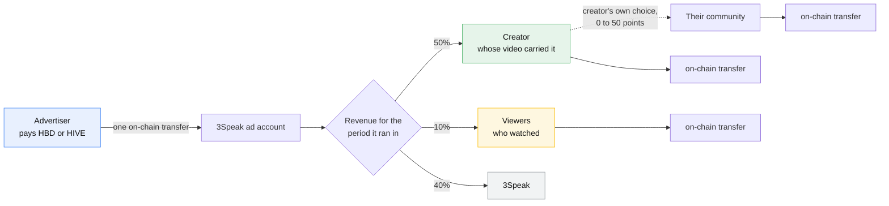
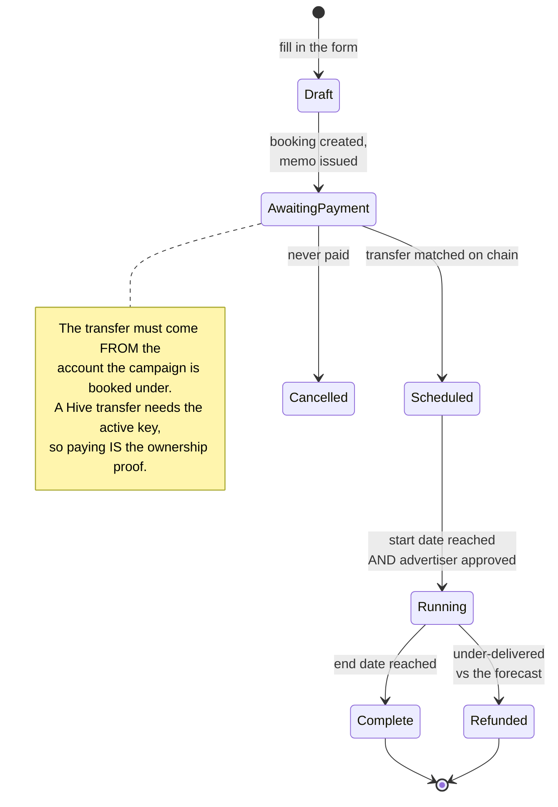
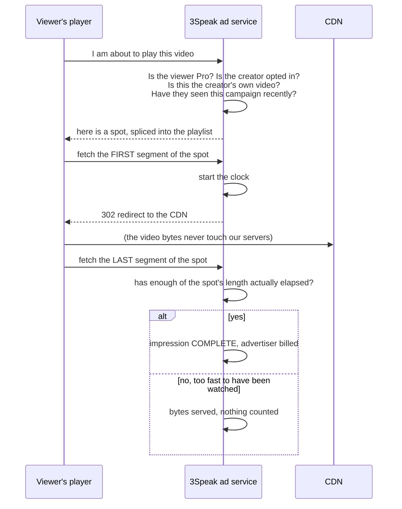
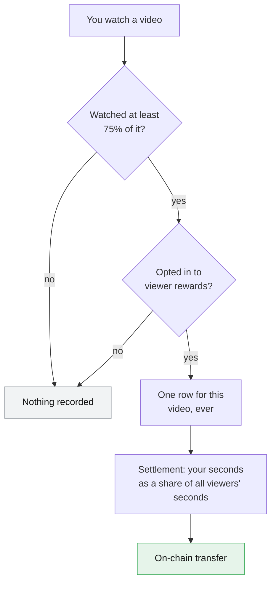
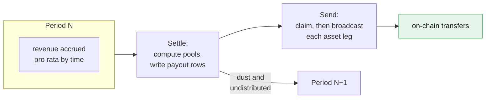

# Advertising on 3Speak

3Speak runs its own advertising system. Advertisers pay in HBD or HIVE, the money is
split on a published schedule, and every payout is an on-chain transfer anybody can
verify. No third-party ad network, no tracking scripts, no data sold.

This document explains how it works: what an advertiser buys, what a creator earns,
what a viewer gets, and exactly how each number is calculated.

> **Status:** the system is built and running in a closed beta. Rates, splits and
> formats below are what the code does today. See [Where this is not finished](#where-this-is-not-finished).

---

## TL;DR

<table>
<tr><th align="left">If you are a…</th><th align="left">Here is the short version</th></tr>
<tr><td><b>Viewer</b></td><td>You can opt in to <b>earn a share of ad revenue for videos you watch</b>, paid in real HBD or HIVE to your Hive account. Viewers take <b>10% of all ad revenue</b>. <b>3Speak Pro subscribers see no ads and still earn</b>. Nothing is tracked unless you opt in, and opting out deletes what was kept.</td></tr>
<tr><td><b>Creator</b></td><td>Ads on your videos pay <b>you</b>, not a network. Creators take <b>50% of all ad revenue</b>, and you can choose to route part of your share to your community. You can switch ads off on your videos entirely. You are never shown an ad on your own video.</td></tr>
<tr><td><b>Advertiser</b></td><td>You buy a spot for a number of seconds, over a number of days, at a published rate. No auction, no CPM, no minimum spend beyond the format price. Pay in HBD or HIVE with one transfer. Longer flights cost meaningfully less per day.</td></tr>
<tr><td><b>Investor</b></td><td>3Speak retains <b>40%</b> of gross ad revenue. Revenue recognition is pro rata by time, not by delivery, so a 30 day flight books across the periods it runs in. Payouts are in the same asset the advertiser paid with, so the platform carries no currency risk on the revenue share. Every distribution is on chain and auditable.</td></tr>
<tr><td><b>Engineer</b></td><td>Server side ad stitching into HLS, epoch anchored settlement periods, idempotent claim-then-send payouts with per asset legs, and a measurement path that never proxies video bytes. Start at <a href="#how-the-code-is-laid-out">How the code is laid out</a>.</td></tr>
</table>

---

## The one diagram



**The split is on gross revenue, not on what is left after costs.** Creator 50, viewer 10,
platform 40. The creator share does not move when a viewer opts in: viewer rewards come
out of the platform's own 40, never out of the creator's 50.

---

## What an advertiser buys

Four formats. Every one is priced the same way: **per second of ad, per day it runs.**

| Format | Where it appears | You supply | Max length |
|---|---|---|---|
| **Video spot** (`video_roll`) | Inside a video on the watch page, at a position you choose | A video | 30s |
| **Player banner** (`video_banner`) | Burned into the player over the video, for a set window | An image | 20s |
| **Pre-upload spot** (`upload_gate`) | Before a creator publishes a video, in the upload studio | A video | 30s |
| **Shorts spot** (`shorts_roll`) | As an item in the shorts feed | A video | 30s |

There is no CPM and no auction. A position is flat tenancy: you book it for a window and
it is yours, shared with at most two other advertisers who take turns. Bidding rewards
the deepest pocket, and on a platform this size it would mean a handful of advertisers
and a lot of unsold time.

### Pricing, exactly

```
price = rate x spot_seconds x days^0.85
```

That exponent is the whole pricing story. At `1.0` you would have a straight line, where
30 days costs 30 times one day. At **0.85** each additional day costs slightly less than
the one before, so a long booking is worth making. The one day price is deliberately
unchanged, because `1^0.85` is still 1: the discount is funded by duration, not by cutting
the entry price everybody judges you on.

**Published rates, and what a 15 second spot costs:**

| Format | Rate (HBD per second, per day) | 1 day | 7 days | 30 days | 90 days |
|---|---|---|---|---|---|
| Video spot | 0.25 | 3.75 | 19.61 | 67.54 | 171.84 |
| Player banner | 0.12 | 1.80 | 9.41 | 32.42 | 82.49 |
| Pre-upload spot | 0.35 | 5.25 | 27.45 | 94.56 | 240.58 |
| Shorts spot | 0.20 | 3.00 | 15.68 | 54.03 | 137.48 |

**What the curve is worth to you**, as a discount on the daily rate:

| Flight | 1 day | 3 days | 7 days | 14 days | 30 days | 60 days | 90 days |
|---|---|---|---|---|---|---|---|
| Cheaper per day by | 0% | 15% | 25% | 33% | 40% | 46% | 49% |

Two things that do **not** curve:

- **Delivery stays linear.** A 30 day flight gets 30 days of plays. Only the price bends.
- **Spot length stays linear.** A 20 second spot costs exactly twice a 10 second one, at
  any flight length. Length is airtime on every single play, so it is charged in full.

Flights run from **1 to 90 days**. An optional production fee (currently 100 HBD) covers
3Speak making the ad video for you, if you do not have one.

### How a booking becomes a running campaign



Payment is verified against the Hive blockchain itself, never against a claim in a
request. The system reads the ad account's transfer history, matches the campaign's
unique memo, and reserves each transaction id under a unique index before crediting
anything, so the same payment can never be counted twice. A transfer from an account
other than the one the campaign is booked under is recorded, refused, and queued for
refund rather than credited.

**Approval is checked at serve time, not just at booking.** Anyone can fill in the form
and pay. Nothing is shown to a single viewer until a human has approved the advertiser,
and the check fails closed: a campaign whose advertiser cannot be confirmed as approved
does not serve.

---

## What counts as an impression

This is the number everything else is computed from, so it is worth being precise.



An impression counts only when the player reaches the **end** of the spot, and only when
enough real time has passed for the spot to have actually played. A script that pulls
every segment in one round trip is served the bytes and counted for nothing.

Deliberately, the ad's video bytes are **never proxied** through 3Speak. Only two tiny
segment requests are measured, and both immediately redirect to the CDN. That keeps
measurement honest without paying to move an advertiser's video twice.

**Nobody is shown an ad if:**

- they subscribe to **3Speak Pro** (the ad-free tier, which still earns: see
  [Pro subscribers earn too](#pro-subscribers-earn-too)),
- the creator has **switched ads off** on their channel,
- they are the **author of the video** they are watching (creators replay their own
  uploads constantly to check them, and every replay would otherwise bill an advertiser
  and pay the creator),
- they have already seen that campaign within the frequency cap window (30 minutes).

---

## How creators are paid

At the end of each settlement period:

```
pool          = revenue for the period x 50%
rate          = pool / total completed impressions in the period
creator earns = rate x their impressions
```

**Every impression is worth the same amount**, whatever format produced it and whichever
creator carried it. A blended rate is a deliberate choice: it means a creator is never
penalised for the format an advertiser happened to buy, and it removes any incentive for
us to steer inventory toward whichever format pays the platform best.

### A worked example

An advertiser books a 15 second video spot for 7 days and pays **19.61 HBD**. Say that
period sees 1,000 completed impressions across all creators, and 40 of them were on your
video.

```
revenue for the period       19.610 HBD
creator pool (50%)            9.805 HBD
rate per impression           9.805 / 1000  = 0.009805 HBD
your 40 impressions           0.009805 x 40 = 0.392 HBD
```

If you set a 20 point community share, that 0.392 splits: your community receives
`0.392 x (20/50) = 0.157 HBD`, and you receive `0.235 HBD`. The community share is
expressed in points of total revenue, so "20" means the community gets 20% of gross,
which is 40% of your 50% share. It is capped at 50, so it can never exceed your own share.

### The community split

Creators choose it themselves, from 0 to 50 points, signed with their Hive key. If a
video is posted in a community, that community's account is paid directly, on chain, in
the same settlement run. If a video is not in a community, the whole creator share stays
with the creator: keeping it would be the self serving reading of a choice made for
somebody else's benefit.

**Community is read from the Hive blockchain, not from our database.** Our copy of a
video's category is a denormalised convenience, and it was measurably wrong on a small
share of videos, which silently underpaid those communities. The chain is the source of
truth for anything that decides where money goes.

---

## How viewers are paid

Viewers take **10% of gross ad revenue**. This is opt-in, and it is opt-in because it
requires us to attach your username to what you watched.



```
your share = viewer pool x (your qualifying seconds / everyone's qualifying seconds)
```

**Rewatching a video earns nothing.** There is exactly one row per viewer per video, ever,
and it records the *best* coverage you ever reached rather than adding up. This is the
core anti-fraud rule for viewer rewards, and it is not theoretical: when we measured it,
rewatching inflated total plays by 63% over distinct viewer-video pairs, and one account
had replayed a single video 85 times. Paying per playback would have paid for all 85.

### Pro subscribers earn too

**Paying for 3Speak Pro removes the ads from your own viewing. It does not remove you
from the pool.** A Pro subscriber who opts in to viewer rewards banks qualifying watches
and is paid out of the same 10% as everybody else, on the same terms.

That is deliberate, and it is worth being explicit about because most platforms work the
other way round. The viewer pool is a share of what advertisers paid for *the whole
audience's attention*, and a subscriber is part of that audience: their watching is what
makes a video worth advertising against in the first place, whether or not a spot was
shown to them personally. Charging someone for an ad-free experience and then also
excluding them from the revenue their viewing helps generate would be taking twice.

So the two things stack. Pro is the fastest a viewer can be net positive on 3Speak: no
ads, and still a share of the ad revenue.

**Below the minimum, you keep your entitlement.** A viewer whose share is under Hive's
0.001 precision is not paid that period, and critically their watch record is *not*
marked settled. Their seconds keep earning and the money that would have been theirs is
carried forward with them. An earlier version claimed those rows and paid nothing, which
silently erased the entitlement of exactly the casual viewers the feature exists for.

---

## Paid in kind

If an advertiser pays in HIVE, the creators and viewers on that revenue are paid in HIVE.
If they pay in HBD, everyone is paid in HBD. A campaign funded in both produces payouts
with two legs.

This is not a detail. It means:

- 3Speak never has to hold or convert a currency to meet its obligations,
- nobody is exposed to a conversion we chose on their behalf,
- and the amounts are exactly traceable from the advertiser's transfer to the recipient's.

Money that could not be distributed (a period with revenue but no impressions, or a long
tail of amounts under Hive's precision) is **carried forward in the asset it arrived as**.
A HIVE funded period carrying into an HBD funded one still pays out HIVE. Folding it into
whatever the next period happened to be funded in would have us sending HBD nobody ever
sent us.

> ⚠️ **An HBD figure is a valuation, not a balance.** Campaign totals are shown in HBD for
> comparison, but a HIVE funded campaign pays out HIVE. "7 HBD worth of HIVE" is not
> "7 HIVE".

---

## Settlement



Periods are **3 days**, anchored to a fixed epoch so every period boundary is derivable
and no two runs can disagree about which period a moment belongs to. Boundaries are set
to land in the European morning, so a human is around when money moves.

**Revenue is recognised pro rata by time, not by delivery.** A 30 day flight paying 300 HBD
accrues 10 HBD per day regardless of how many impressions land on any given day. That
keeps a creator's earnings stable against the advertiser's delivery curve.

**Sending is claim-then-send, with each asset leg recorded as it lands.** A two leg payout
whose second leg fails leaves the first marked as sent, so a retry sends only what is
still owed. Hive transfers carry no idempotency key, so the irreducible risk is a crash
in the instant between broadcasting a leg and recording it, and that is bounded to one leg.

---

## Privacy

- **Viewers are anonymous by default.** Watch history exists so you can find things again;
  it is not attached to your identity for advertising unless you opt in to rewards.
- **Opting in stores your username against videos you watched past 75%.** Nothing else.
- **Opting out deletes it.** Not flags it, deletes it.
- **No third-party ad JavaScript.** Nothing is loaded from an ad network, so there is
  nothing to fingerprint you with, and no data leaves 3Speak.
- **The frequency cap is carried by the client**, not by an identity we keep, so we do not
  need a durable profile of an anonymous viewer to avoid showing them the same ad twice.

---

## Trust, and the honest limits

Things that are genuinely hard to abuse:

- **Payment cannot be faked.** It is verified against Hive, with each transaction id
  reserved under a unique index before anything is credited.
- **Price cannot be tampered with.** The server computes the price from its own rate card.
  A quote shown in the browser is computed from the same formula, sent by the server, so
  the two cannot drift.
- **Rewatching earns nothing** for viewers, by construction.
- **Self-views earn nothing.** A creator is never served an ad on their own video.
- **Impressions cannot be banked instantly.** Completion requires that a real proportion
  of the spot's length has elapsed.

Things that are **not** fully solved, stated plainly:

- **Impression measurement is client observed.** As with every ad system that does not
  proxy video, a determined party can drive the measurement endpoints directly. Pacing
  makes each fake impression cost real wall-clock time, and the frequency cap limits
  repetition, but neither makes it impossible. Today the exposure is small because ads
  serve on a short allowlist of channels. It becomes a real concern the day that list
  opens up, and per-network rate limiting is the next step.
- **The pre-upload gate is enforced in the browser.** The publish endpoint does not yet
  verify a signed receipt proving the spot was watched.
- **Viewer settlement scans all unpaid rows.** Correct, but it will need a bounded query
  before the long tail of sub-minimum viewers gets large.

---

## Where this is not finished

| Area | State |
|---|---|
| Booking, payment, serving, settlement, payout | Built and proven on chain |
| Creator payouts, community splits | Built, running |
| Viewer rewards | Built, opt-in live, paying |
| Pre-upload gate | Built, client enforced only |
| Public launch | Closed beta on an allowlist |
| Third-party ad networks | Researched, not adopted |

---

## How the code is laid out

For anyone picking this up. The advertising system spans two services.

| Concern | Where |
|---|---|
| Serving, splicing, measurement | `routes/adServe.js` |
| Booking, payment verification, refunds | `routes/adCampaigns.js` |
| Advertiser records, creator and viewer preferences | `routes/advertise.js` |
| Settlement and payouts | `services/adPayouts.js` |
| Price, formats, campaign state machine | `utils/adModel.js`, `utils/adFormats.js` |
| Who may be shown an ad | `utils/adEligibility.js` |
| Banner burn-in | `services/adBurner.js` |
| The advertiser-facing page | `src/page/Advertise.jsx` |
| Player and feed integration | `src/lib/adBreak.js`, `src/lib/shortsAd.js`, `src/lib/uploadGate.js` |

Two conventions worth knowing before changing anything:

1. **One definition of price.** `priceForDays()` computes both the quote shown to an
   advertiser and the price written on the campaign. The browser never carries its own
   copy of the formula; the curve exponent is sent to it by the server.
2. **Settlement is idempotent and marks its inputs.** A settled period is skipped, and
   settled impressions carry the period key. Anything that cannot be resolved with
   certainty, such as a video whose community the chain will not confirm, leaves the
   period unsettled to be retried rather than paying a guess.

---

*Questions about advertising on 3Speak: open an issue, or reach the team on Hive.*
